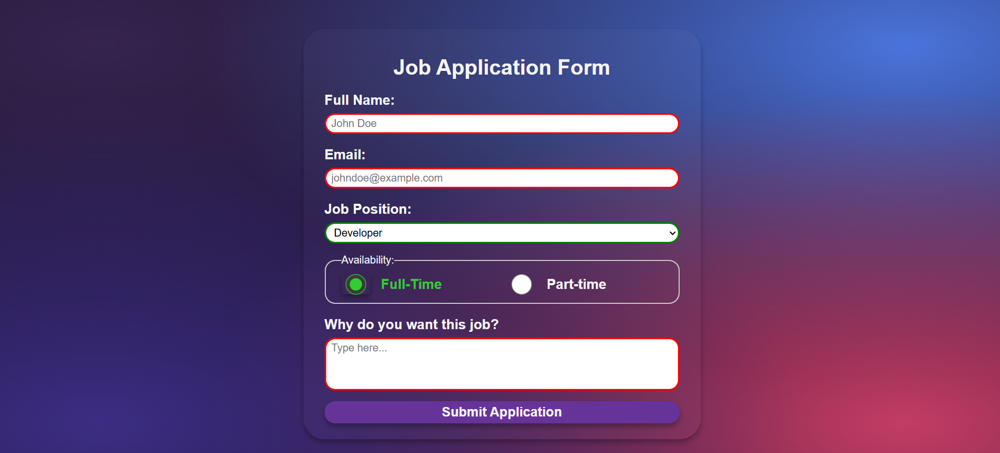

# 📁 Job Application Form

## ℹ️ A simple landing page for a job application form

This project is a **simple yet fully functional job application form** built with HTML and CSS. It includes form controls, radio buttons, a select dropdown, text area, and form validation to collect job applicant details.

It was built entirely with HTML and CSS as part of the [**freeCodeCamp.org**](https://www.freecodecamp.org/learn/full-stack-developer/) CSS course.

---

## 🔍 Overview

This form-based project is designed to simulate a typical job application process, where users can fill out their name, email, job position, availability, and a short motivation message.  
It demonstrates proper semantic markup, organized form structure, focus states, field validation, and responsiveness on smaller devices.

The background uses a colorful radial gradient setup that enhances the aesthetic without compromising readability or usability. All fields are styled for accessibility and clarity.

---

## ✨ Features

- Semantic HTML5 form elements
- Custom-styled radio group using CSS Grid
- Responsive layout for smaller screen sizes
- Focus and hover visual feedback
- Accessible label associations
- HTML5 built-in validation (`required`, `type`)
- Decorative yet usable radial gradient background
- Graceful fallback with plain CSS and no JavaScript required
- Form submission handled via `https://httpbin.org/post` (for test/demo purposes)

---

## 🧠 What I Learned

- How to structure a semantic and accessible HTML form
- Styling `fieldset` and radio inputs using CSS Grid
- Applying validation states using `:valid` and `:invalid` selectors
- Improving focus and hover interaction for better UX
- Building visually appealing UI with layered background gradients
- Designing layout containers using `max-width` and `min-height`
- Using `accent-color` and `box-shadow` for enhanced form controls

---

## 🛠️ Tech Used

- HTML5
- CSS3

---

## 🚀 How to Run

1. Clone the repository
2. Navigate to this project folder
3. Open `index.html` in your browser

---

## 🌐 Live Demo

Or you can check out the 👉 [live website here](https://html-css-daily.netlify.app/build%20a%20job%20application%20form/)

---

## 🧑‍💻 Author

Created by **Elmar Chavez**

🗓️ Month/Year: **May 2025**

📚 Journey: **2nd** month of learning _frontend web development_.
